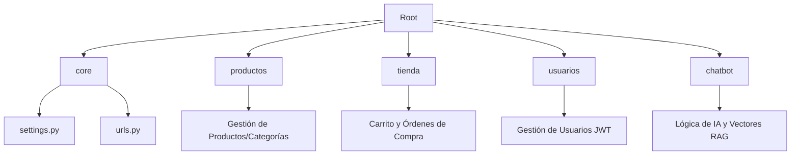

# Ecommerce API RAG DRF


**Ecommerce-API-RAG-DRF** es un sistema backend robusto para eCommerce que integra un asistente virtual inteligente (Chatbot RAG) capaz de responder preguntas sobre el inventario en tiempo real utilizando búsqueda semántica y modelos de lenguaje grandes.

## 🚀 Descripción

Este proyecto resuelve el problema de la búsqueda estática en tiendas online, permitiendo a los usuarios interactuar con un asistente ("Trivenly") que entiende el contexto de los productos, precios y categorías, ofreciendo una experiencia de compra personalizada y eficiente.

## 📋 Requisitos Previos

- **Python**: 3.10 o superior
- **Django**: 5.2
- **Pip**: Última versión
- **Venv**: Recomendado para aislamiento de dependencias

## 🛠️ Instalación Paso a Paso

1. **Clonar el repositorio:**

   ```bash
   git clone https://github.com/DaniDevGS/Ecommerce-API-RAG-DRF.git
   cd Ecommerce-API-RAG-DRF
   ```

2. **Crear y activar entorno virtual:**

   ```bash
   python -m venv venv
   .\venv\Scripts\activate  # En Windows
   source venv/bin/activate # En Linux/Mac
   ```

3. **Instalar dependencias:**

   ```bash
   pip install -r requirements.txt
   ```

4. **Configurar variables de entorno:**
   Crea un archivo `.env` en la raíz del proyecto basándote en la sección de [Variables de Entorno](#-variables-de-entorno).

5. **Ejecutar migraciones:**

   ```bash
   python manage.py migrate
   ```

6. **Iniciar el servidor:**
   ```bash
   python manage.py runserver
   ```

## 🏗️ Estructura del Proyecto



- **core/**: Configuración central del proyecto Django.
- **productos/**: Modelos y vistas para el inventario, incluyen lógica de conversión de divisas.
- **tienda/**: Gestión del flujo de compra (Carrito -> Orden -> Stock).
- **usuarios/**: Autenticación personalizada con SimpleJWT.
- **chatbot/**: Integración con Groq y Upstash Vector para asistencia inteligente.

## 🔑 Variables de Entorno

| Variable                    | Descripción                           | Ejemplo                  | Obligatoria |
| :-------------------------- | :------------------------------------ | :----------------------- | :---------: |
| `SECRET_KEY`                | Llave secreta de Django               | `django-insecure...`     |     Sí      |
| `GROQ_API_KEY`              | API Key para modelos de lenguaje Groq | `gsk_...`                |     Sí      |
| `UPSTASH_VECTOR_REST_URL`   | URL de la base de datos de vectores   | `https://...upstash.io`  |     Sí      |
| `UPSTASH_VECTOR_REST_TOKEN` | Token de Upstash Vector               | `ABUF...`                |     Sí      |
| `LLAMACPP_API`              | Endpoint opcional para Llama.cpp      | `http://localhost:8080/` |     No      |

## 🧪 Ejecución de Tests

Para validar que todo el sistema funciona correctamente:

```bash
python manage.py test
```

## 📄 Licencia

Este proyecto bajo la licencia de **Uso Personal Únicamente**. No está permitida la distribución, venta o uso en entornos de producción. Consulta el archivo [LICENSE](./LICENSE) para más detalles.

---
